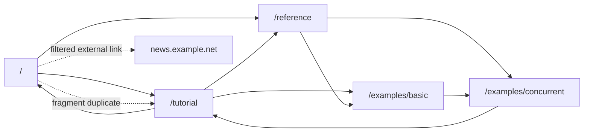
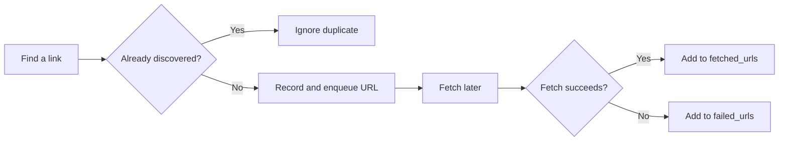
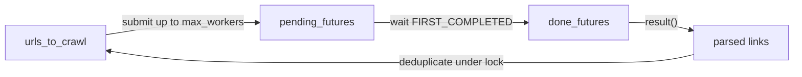

# Python Concurrency Crawler Lab

[English](README.md) | [简体中文](README.zh-CN.md)

Learn Python concurrency through a small web crawler that is safe to run offline. The same five-page website is crawled in three ways:

| Implementation | Core idea |
| --- | --- |
| `SequentialWebCrawler` | Fetch one page at a time to establish the baseline. |
| `ThreadPoolWebCrawler` | Run blocking page fetches in worker threads. |
| `AsyncWebCrawler` | Coordinate non-blocking page fetches with `asyncio`. |

The project is deliberately small. It teaches the state and coordination ideas first, before adding real HTTP, retries, or production concerns.

## Quick Start

Requires Python 3.10+ and no third-party dependencies.

```bash
python3 synchronous_crawlers.py
python3 async_crawler.py
python3 compare_examples.py
python3 -m unittest -v
```

`compare_examples.py` runs each crawler against identical simulated network delays. Typical output shows the threaded and asyncio versions completing sooner than the sequential version because page downloads are I/O-bound.

## Project Layout

```text
python-concurrency-crawler-lab/
├── shared.py                 # Offline site, blocking/async fetch APIs, link parsing
├── synchronous_crawlers.py   # Sequential and thread-pool crawlers
├── async_crawler.py          # Asyncio crawler
├── compare_examples.py       # Runtime comparison
├── test_crawlers.py          # Behavior tests
├── scripts/check_docs_sync.py
└── README.zh-CN.md           # Chinese translation
```

## The Offline Website

`shared.py` contains an in-memory site. It includes relative URLs, duplicate fragments, cycles, an external link, and a non-HTTP link, so the crawler performs realistic filtering without accessing the network.



The shared parser:

- Resolves relative links such as `/tutorial`.
- Removes fragments such as `#threads`.
- Keeps only HTTP(S) pages on the same host.
- Removes duplicates discovered on the same page.

## 1. Start With Breadth-First Search

A crawler sees a website as a graph: pages are nodes and links are edges. The sequential implementation uses a FIFO queue:

```python
self.urls_to_crawl = deque([starting_url])

while self.urls_to_crawl:
    current_url = self.urls_to_crawl.popleft()
    self.crawl_page(current_url)
```

It tracks separate meanings:

| State | Meaning |
| --- | --- |
| `urls_to_crawl` | Discovered URLs waiting to be fetched. |
| `discovered_urls` | URLs already queued, used for deduplication. |
| `fetched_urls` | Pages successfully fetched; this is the returned result. |
| `failed_urls` | Pages that were scheduled but could not be fetched. |

A URL is marked as discovered when it is queued, not after it is fetched. Otherwise, multiple linking pages could enqueue it repeatedly.



The sequential crawler exposes deterministic BFS fetch order. Concurrent crawlers preserve discovery filtering and reachability, but completion order depends on timing; they are not strict layer-by-layer BFS demonstrations.

## 2. Why Concurrency Helps

Fetching a page is I/O-bound work: most time is spent waiting for a response. Concurrency overlaps those waits.

| Concept | Meaning here |
| --- | --- |
| Concurrency | Multiple page requests are in progress during overlapping time. |
| Parallelism | CPU work literally runs at the same instant on multiple cores. |
| I/O-bound | Waiting for network dominates execution time. |
| CPU-bound | Parsing or computation dominates execution time. |

Threads and asyncio improve this example because requests spend time waiting. For heavy pure-Python CPU work, threads usually do not scale linearly because of the GIL; a process-based approach is often worth considering.

## 3. Thread Pool: Blocking APIs With Workers

The thread-pool crawler calls the ordinary blocking fetch API:

```python
future = thread_pool.submit(self.crawl_page, url)
```

`submit()` hands work to a worker thread and immediately returns a `Future`, a handle to that submitted task:

```python
future.done()    # Whether the task finished.
future.result()  # Obtain its result or re-raise an unexpected exception.
```

The crawler keeps only a bounded number of submitted fetches active:

```python
done_futures, pending_futures = wait(
    self.pending_futures,
    return_when=FIRST_COMPLETED,
)
```



Important precision: `max_workers` bounds submitted in-flight fetches in this example. It does **not** bound the total discovered URL frontier; a large website could still make `urls_to_crawl` grow. Page limits, depth limits, or a bounded queue would be additional controls.

### Why A Lock?

Worker threads can discover links simultaneously. This check-and-enqueue sequence must be atomic:

```python
if link not in self.discovered_urls:
    self.discovered_urls.add(link)
    self.urls_to_crawl.append(link)
```

`threading.Lock` prevents two threads from both queuing the same URL.

## 4. Asyncio: Tasks On An Event Loop

The async version uses a fetch API that yields control while it waits:

```python
async def get_html_content_async(url: str) -> str:
    await asyncio.sleep(delay)
    return page_html
```

| Code | Behavior |
| --- | --- |
| `time.sleep(...)` | Blocks the current thread. |
| `await asyncio.sleep(...)` | Suspends only the current coroutine so other tasks can advance. |

The crawler schedules tasks and waits for progress:

```python
task = asyncio.create_task(self.fetch_links(url))
done_tasks, pending_tasks = await asyncio.wait(
    pending_tasks,
    return_when=asyncio.FIRST_COMPLETED,
)
```

```mermaid
sequenceDiagram
    participant Loop as Event Loop
    participant A as Task: /tutorial
    participant B as Task: /reference
    Loop->>A: run until await
    A-->>Loop: wait for response
    Loop->>B: run until await
    B-->>Loop: wait for response
    B->>Loop: response is ready
    Loop->>Loop: queue new links
    A->>Loop: response is ready
    Loop->>Loop: schedule more work
```

An asyncio `Task` plays a role similar to a thread-pool `Future`: it represents scheduled work and exposes completion or failure. The difference is that the tasks here advance on one event loop thread rather than executing blocking fetches in worker threads.

This implementation updates shared crawler state only in `run()` after completed tasks return links, so it does not need a lock. That is a design property of this example, not a rule that async programs never need synchronization.

## 5. Choosing A Model

| Situation | Useful starting point |
| --- | --- |
| Validate crawl behavior and URL filtering | Sequential crawler |
| Existing blocking client such as `requests` | Thread pool |
| Async HTTP client and many in-flight I/O requests | Asyncio |
| Heavy CPU processing | Consider processes or other CPU parallelism |

Putting `requests.get()` directly inside `async def` does not make it asynchronous; it still blocks the event loop. A real asyncio crawler would use an async HTTP client such as `aiohttp` or `httpx.AsyncClient`, or deliberately move a blocking call into a thread with `asyncio.to_thread()`.

## 6. Reliability Concepts To Learn Next

The executable core keeps the first lesson focused: URL normalization, deduplication, success/failure state, and bounded in-flight requests. The next concepts are:

| Topic | Why it matters |
| --- | --- |
| Timeout | A slow request must not occupy capacity forever. |
| Exception propagation | Background failures must be observed. |
| Cancellation | Stopping a crawl should clean up outstanding tasks. |
| Retry with backoff | Temporary failures need controlled recovery. |
| Rate limiting | Available concurrency is not permission to overload a site. |
| Page/depth limit | Active-request limits do not bound total crawl growth. |
| `robots.txt` and `User-Agent` | Real crawlers should behave responsibly. |

For Python 3.10, an async timeout exercise can start with:

```python
html_content = await asyncio.wait_for(get_html_content_async(url), timeout=1.0)
```

For Python 3.11+, `asyncio.timeout()` offers a context-manager alternative.

## Learning Path

1. Run the three implementations and the tests.
2. Trace `SequentialWebCrawler` until the BFS order and four state collections are clear.
3. Change `max_workers` in the thread-pool crawler and observe elapsed time.
4. Trace `Future`, `wait(FIRST_COMPLETED)`, and the protected check-and-enqueue update.
5. Change `max_concurrency` in the asyncio crawler and trace how `Task` objects yield at `await`.
6. Temporarily replace `await asyncio.sleep()` with `time.sleep()` in the async fetcher and explain the performance change.
7. Add one small reliability extension: timeout, failed-page retry, or a maximum-page limit.

## Knowledge Check

- Why mark a URL discovered when it is queued rather than when its fetch completes?
- Why does the sequential version have deterministic BFS order while concurrent completion order does not?
- What does a `Future` represent, and why call `future.result()`?
- Why does a thread-pool crawler need a lock around deduplication and enqueueing?
- What is the difference between an asyncio `Task` and a worker thread?
- Why must an async crawler avoid directly calling blocking HTTP APIs?
- What does the concurrency limit bound, and what does it leave unbounded?
- When would timeout, cancellation, rate limiting, or a page limit become necessary?

## Documentation Languages

The English and Chinese READMEs are maintained together. A GitHub Actions check fails a pull request if only one language version is modified or if the language-switch links are removed. When changing concepts, diagrams, commands, or examples, update both files in the same pull request.
