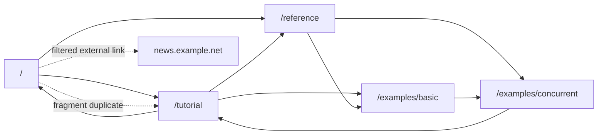
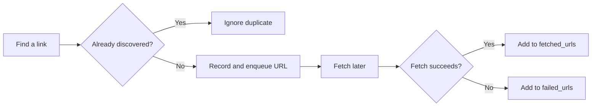
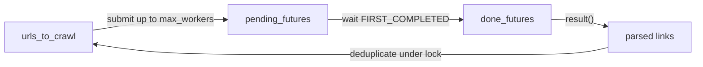

# Python Concurrency Crawler Lab | Python 并发爬虫学习实验室

[English](README.md) | [简体中文](README.zh-CN.md)

这是一个通过小型网页爬虫学习 Python 并发模型的项目。项目使用离线的五页示例网站，不会访问真实网络，因此适合稳定运行、调试和分享。

同一个网站由三种实现抓取：

| 实现 | English Term | 核心思想 |
| --- | --- | --- |
| `SequentialWebCrawler` | Sequential crawler | 一次抓取一个页面，建立理解基准 |
| `ThreadPoolWebCrawler` | Thread-pool crawler | 用工作线程并发运行阻塞式抓取 |
| `AsyncWebCrawler` | Asyncio crawler | 用事件循环调度非阻塞等待任务 |

本项目刻意保持简洁：先理解状态、任务和调度，再学习真实 HTTP、重试与生产级约束。

## 课程网站 | Course Website

打开可视化互动课程网站：

[https://yushengauggie.github.io/python-concurrency-crawler-lab/zh-CN.html](https://yushengauggie.github.io/python-concurrency-crawler-lab/zh-CN.html)

网站包含并发时间线滑块、可视化图、代码片段与短自查题。仓库中可运行的 Python 文件仍是权威代码来源。

## 快速开始 | Quick Start

要求 Python 3.10 或更高版本，不需要第三方依赖。

```bash
python3 synchronous_crawlers.py
python3 async_crawler.py
python3 compare_examples.py
python3 -m unittest -v
```

`compare_examples.py` 让三种 crawler 在相同的模拟网络延迟下运行。由于下载页面属于 I/O-bound work（I/O 密集型工作），thread pool 和 asyncio 通常会比顺序版本更快。

## 项目结构 | Project Layout

```text
python-concurrency-crawler-lab/
├── shared.py                 # 离线站点、同步/异步抓取 API、链接解析
├── synchronous_crawlers.py   # 顺序爬虫与线程池爬虫
├── async_crawler.py          # Asyncio 爬虫
├── compare_examples.py       # 运行时间比较
├── test_crawlers.py          # 行为测试
├── test_lessons.py           # 进阶课程测试
├── lessons/                  # 可运行的 timeout/retry/semaphore/cancellation 课程
├── docs/                     # GitHub Pages 静态互动课程网站
├── scripts/check_docs_sync.py
└── README.zh-CN.md           # 中文文档
```

## 离线网站 | The Offline Website

`shared.py` 定义了一个内存中的网站。它包含相对链接、重复 fragment、循环链接、外站链接与非 HTTP 链接，所以无需访问网络也能练习真实的链接过滤。



共享的解析函数负责：

- 将 `/tutorial` 等相对链接解析为完整 URL。
- 移除 `#threads` 等 fragment。
- 只保留同一域名内的 HTTP(S) 页面。
- 去掉同一页面中重复发现的链接。

## 1. 从广度优先搜索开始 | Breadth-First Search

爬虫可以把网站视为图（graph）：页面是节点（node），链接是边（edge）。顺序实现使用 FIFO queue：

```python
self.urls_to_crawl = deque([starting_url])

while self.urls_to_crawl:
    current_url = self.urls_to_crawl.popleft()
    self.crawl_page(current_url)
```

它区分以下状态：

| 状态 | 含义 |
| --- | --- |
| `urls_to_crawl` | 已发现、正在等待抓取的 URL |
| `discovered_urls` | 已经入队过的 URL，用于去重 |
| `fetched_urls` | 成功抓取的页面，也是返回结果 |
| `failed_urls` | 已安排抓取但失败的页面 |

URL 应该在入队时标记为 discovered，而不是在抓取完成后才标记。否则多个页面可能把同一链接重复加入队列。



顺序爬虫的抓取次序是可观察且确定的 BFS 顺序。并发版本能够保证过滤和可达页面抓取，但完成顺序由运行时间决定，不是严格的逐层 BFS 演示。

## 2. 为什么并发有帮助 | Why Concurrency Helps

抓取页面属于 I/O-bound work：大部分时间在等待响应。Concurrency（并发）让这些等待时间相互重叠。

| 概念 | 在本项目中的含义 |
| --- | --- |
| Concurrency（并发） | 多个页面请求在重叠时间内进行 |
| Parallelism（并行） | 多个 CPU 核在同一时刻真正计算 |
| I/O-bound（I/O 密集型） | 时间主要花在等待网络响应 |
| CPU-bound（CPU 密集型） | 时间主要花在解析或计算 |

Thread pool 与 asyncio 能改善本例，是因为请求会等待。在常见的启用了 GIL（Global Interpreter Lock）的 CPython 构建中，普通线程通常不能让纯 Python CPU 计算线性加速；若工作变为重度计算，值得学习 process-based parallelism。

## 3. 线程池：用 Worker 执行阻塞 API | Thread Pool

线程池爬虫调用普通的阻塞式抓取函数：

```python
future = thread_pool.submit(self.crawl_page, url)
```

`submit()` 将工作交给一个 worker thread，并立即返回 `Future`。`Future` 是已提交任务的句柄（handle）：

```python
future.done()    # 任务是否结束
future.result()  # 获取结果，或重新抛出意外异常
```

爬虫只保留受限数量的已提交抓取请求：

```python
done_futures, pending_futures = wait(
    self.pending_futures,
    return_when=FIRST_COMPLETED,
)
```



需要精确理解的是：`max_workers` 在本例中限制的是 in-flight fetches（正在处理的抓取请求）数量。它**不会**限制全部已发现 URL 的数量；大型网站仍可能使 `urls_to_crawl` 增长。要限制整体增长，还需要最大页面数、最大深度或有界队列等机制。

### 为什么需要锁 | Why A Lock Is Needed

多个 worker thread 可能同时发现链接。下面的检查与入队必须是 atomic operation（原子操作）：

```python
if link not in self.discovered_urls:
    self.discovered_urls.add(link)
    self.urls_to_crawl.append(link)
```

`threading.Lock` 防止同一 URL 被两个线程重复加入队列。

## 4. Asyncio：事件循环上的 Task | Asyncio Tasks

异步版本使用会在等待时让出控制权的抓取 API：

```python
async def get_html_content_async(url: str) -> str:
    await asyncio.sleep(delay)
    return page_html
```

| 代码 | 行为 |
| --- | --- |
| `time.sleep(...)` | 阻塞当前线程 |
| `await asyncio.sleep(...)` | 只暂停当前 coroutine，让其他任务继续 |

爬虫创建任务并等待真实进展：

```python
task = asyncio.create_task(self.fetch_links(url))
done_tasks, pending_tasks = await asyncio.wait(
    pending_tasks,
    return_when=asyncio.FIRST_COMPLETED,
)
```

```mermaid
sequenceDiagram
    participant Loop as Event Loop
    participant A as Task: /tutorial
    participant B as Task: /reference
    Loop->>A: run until await
    A-->>Loop: wait for response
    Loop->>B: run until await
    B-->>Loop: wait for response
    B->>Loop: response is ready
    Loop->>Loop: queue new links
    A->>Loop: response is ready
    Loop->>Loop: schedule more work
```

Asyncio 的 `Task` 与 thread-pool 的 `Future` 作用相似：都表示已经安排的工作，并暴露完成或失败状态。区别在于，此处的 tasks 在一个 event loop thread 上推进，而不是在线程池中执行阻塞抓取。

这个实现只在 `run()` 中处理完成 task 返回的链接并更新共享状态，因此不需要锁。这是本例的状态所有权设计结果，不表示所有 async 程序都不需要同步控制。

## 5. 如何选择模型 | Choosing A Model

| 情况 | 合适的起点 |
| --- | --- |
| 验证遍历和链接过滤逻辑 | Sequential crawler |
| 已有 `requests` 等 blocking client | Thread pool |
| 有 async HTTP client 且需要大量 I/O 并发 | Asyncio |
| 有重度 CPU 处理 | 考虑进程或其他 CPU 并行方案 |

将 `requests.get()` 直接放进 `async def` 并不会使它变为异步调用，它仍会阻塞 event loop。真实 async crawler 通常使用 `aiohttp`、`httpx.AsyncClient`，或者有意识地用 `asyncio.to_thread()` 隔离 blocking call。

## 6. 下一步可靠性主题 | Reliability Concepts To Learn Next

可运行的核心代码聚焦于 URL 规范化、去重、成功/失败状态和在途请求限制。接下来请按照 [lessons/README.zh-CN.md](lessons/README.zh-CN.md) 继续动手：

| 课程 | 可运行命令 | 为什么重要 |
| --- | --- | --- |
| Timeout（超时） | `python3 -m lessons.lesson_timeout` | 慢请求不应永久占用容量 |
| Retry with backoff（退避重试） | `python3 -m lessons.lesson_retry` | 临时失败需要受控恢复 |
| Semaphore（信号量） | `python3 -m lessons.lesson_semaphore` | 已调度 tasks 不应无限激活请求 |
| Cancellation（取消） | `python3 -m lessons.lesson_cancellation` | 停止工作时应完整收集未完成任务 |

Python 3.10 的 async timeout 练习可以从这里开始：

```python
html_content = await asyncio.wait_for(get_html_content_async(url), timeout=1.0)
```

Python 3.11 及更高版本也可以使用 `asyncio.timeout()` context manager。

完成这些可运行课程后，可以为 crawler 增加最大页面数限制；在改造成真实网站抓取前，再学习 rate limiting、`robots.txt` 与能够标识调用方的 `User-Agent`。

## 学习路线 | Learning Path

1. 运行三种实现以及测试。
2. 跟踪 `SequentialWebCrawler`，直到理解 BFS 顺序和四种状态。
3. 调整线程池中的 `max_workers` 并观察耗时。
4. 跟踪 `Future`、`wait(FIRST_COMPLETED)` 与被锁保护的检查入队操作。
5. 调整 asyncio 中的 `max_concurrency`，观察 `Task` 如何在 `await` 时交还控制权。
6. 暂时将 async fetcher 中的 `await asyncio.sleep()` 换成 `time.sleep()`，解释性能变化。
7. 按照 [lessons/README.zh-CN.md](lessons/README.zh-CN.md) 完成每个可运行例子及课后自查。
8. 增加最大页面数限制，将活跃请求控制与总抓取规模控制联系起来。

## 核心自检问题 | Knowledge Check

- 为什么 URL 要在入队时标记为 discovered，而不是在抓取结束时？
- 为什么顺序版本具有确定 BFS 次序，而并发完成顺序不确定？
- `Future` 表示什么，为什么需要调用 `future.result()`？
- 为什么线程池爬虫需要锁保护去重和入队？
- Asyncio `Task` 和 worker thread 有什么不同？
- 为什么 async crawler 不能直接调用 blocking HTTP API？
- 并发上限限制了什么，又没有限制什么？
- 何时需要 timeout、cancellation、rate limiting 或页面数量上限？

## 官方参考资料 | Official References

- [`asyncio` 概览](https://docs.python.org/zh-cn/3.10/library/asyncio.html)
- [Coroutines、Tasks、`wait_for()`、cancellation 与 `wait()`](https://docs.python.org/zh-cn/3.10/library/asyncio-task.html)
- [包含 `Semaphore` 的 asyncio 同步原语](https://docs.python.org/zh-cn/3.10/library/asyncio-sync.html)
- [`concurrent.futures`、`Future` 与 `ThreadPoolExecutor`](https://docs.python.org/zh-cn/3.10/library/concurrent.futures.html)

## 文档语言同步 | Documentation Languages

英文和中文的主指南、进阶课程指南以及网站页面都需要一起维护。GitHub Actions 检查会在 pull request 只修改某一组中的一个语言版本，或移除语言切换链接时失败。修改概念、图、命令或示例时，请在同一个 pull request 中同步更新两种语言版本。
